 

# 👋 Hello, I'm M R Khan Dipu! 🔥

> **Web Developer** | Building fast interfaces with Next.js, React and TypeScript, and shipping them to production.

## 🧑‍💻 About Me

I'm a web developer based in Dhaka, Bangladesh. I build responsive apps and connect them to the parts that make them real: sign-in with email verification, live API data, saved user state and charts. I hold a BSc and an MSc in Software Engineering with a Data Science major, so I can also put a trained model behind a web page.

- 🔭 **Currently working on:** Next.js 16 apps with full authentication (better-auth, Google OAuth, MongoDB, Resend)
- 🌱 **Learning:** how to bring machine learning models into production web apps
- 💬 **Ask me about:** Next.js, React, TypeScript, Tailwind CSS, auth flows and state management
- 🧠 **Also:** a published researcher in deep learning for EEG and medical data, with two conference papers
- 📫 **Reach me at:** [mrkhan.ds.swe@gmail.com](mailto:mrkhan.ds.swe@gmail.com)
- ⚡ **Fun fact:** I code the web by day and train neural networks on brain signals by night

🛠️ Tech Stack

  

## 📈 GitHub Stats

<picture>
  <source media="(prefers-color-scheme: dark)" srcset="https://raw.githubusercontent.com/theopsupcorp1009/theopsupcorp1009/output/github-snake-dark.svg">
  <source media="(prefers-color-scheme: light)" srcset="https://raw.githubusercontent.com/theopsupcorp1009/theopsupcorp1009/output/github-snake.svg">
  
</picture>

## ⭐ Highlights

### 🚀 What each project does

| Project | What it does | Stack | Live |
|---------|--------------|-------|:----:|
| 📰 **Bangla News 24** | Bengali news portal with live headlines, category pages, a "Most Read" sidebar, a scrolling ticker and full auth: email and password, Google sign-in, email verification, password reset and protected routes | Next.js, TypeScript, Tailwind 4, better-auth, MongoDB, Resend |  |
| 💪 **FitLog** | Gym companion with a 12-workout library, daily plan and saved list, sorting, live navbar counters and a plan that survives reloads | Next.js, React, DaisyUI, Context API, localStorage |  |
| 🚀 **HERO.IO** | App-store style marketplace with a trending carousel, live search, install and uninstall, and a sortable personal library | Next.js, TypeScript, Tailwind 4, DaisyUI |  |
| 📚 **Book Vibe** | Book catalog and reading tracker with wishlist, read list, sorting and a pages-read bar chart | Next.js 16, React 19, TypeScript, Recharts |  |
| 🧠 **Alzheimer Stage Classifier** | Upload a brain MRI and a CNN predicts one of four dementia stages with a probability for each. An educational prototype, not a medical tool | Streamlit, TensorFlow, Keras |  |
| ⚛️ **Quantum Circuit Explorer** | Build and simulate 12 quantum circuits with diagrams, histograms and Bloch spheres | Streamlit, Qiskit, Qiskit Aer |  |

## 📬 Contact Me

&nbsp;&nbsp;
&nbsp;&nbsp;
&nbsp;&nbsp;

  

Open to web developer roles. Let's build something good.

